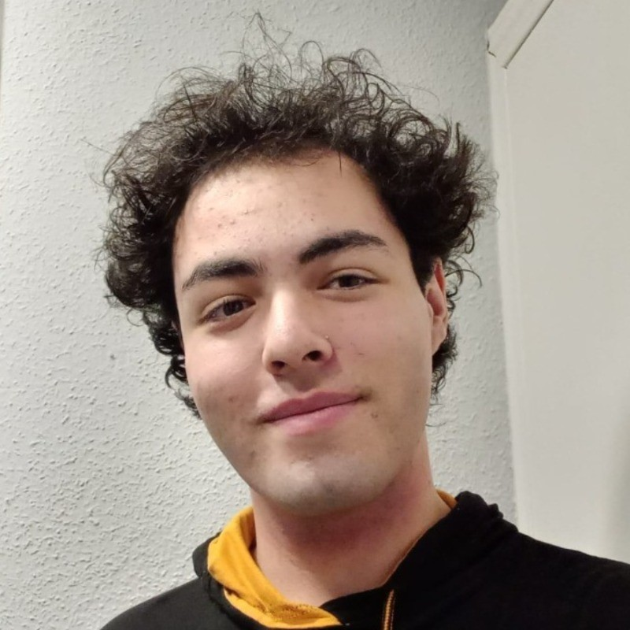

<!-- Include Google Fonts -->
<link href="https://fonts.googleapis.com/css2?family=Roboto:wght@400;500;700&display=swap" rel="stylesheet">

  <!-- Main Content -->
  

    <!-- Profile Image -->
    

      
    

    <h2>Featured Projects</h2>
    <ul>
      <li>
        <a href="https://github.com/HevCuesta/TransportHelper" style="color:#1e88e5; font-weight:500;">Transport Helper</a> — A mobile app for TEA teenagers to use Madrid's public transportation independently. Won first place in the trasTEA competition. 
      </li>
      <li style="margin-top: 1rem;">
        <a href="https://github.com/Proyecto-de-Computacion-I-y-II/Front" style="color:#1e88e5; font-weight:500;">Food Advisor</a> — Full-stack web app for creating shopping lists with AI-powered recommendations. 
        <strong>Frontend:</strong> TypeScript, HTML, CSS 
        <strong>Backend:</strong> PHP, Blade 
        AI recommendations prioritize seasonal foods for a balanced, cost-effective diet.
      </li>
    </ul>

    <h2 style="margin-top:2rem;">What I am currently doing</h2>
    <ul>
      <li>
        <a href="https://github.com/rafagithub15/hermopolis" style="color:#1e88e5; font-weight:500;">Hermopolis</a> — Developing AI-based human pose detection for community areas to practice taekwondo and yoga.
      </li>
    </ul>

  

  <!-- Sidebar / Lateral Content -->
  

    <h2>Other Achievements</h2>
    

      <!-- Badge-style achievements -->
      Ada Byron (2023 & 2025)
      Innovation Leader - Vodafone Campus Lab
      Computer Science Club Leader (2024–2025)

      <!-- Optional: Add icons using emojis -->
      🏆 Hackathons & Workshops

    

  

<h2 style="margin-top:2rem;">Contact</h2>
<ul>
  <li>Email: <a href="mailto:javierchouzapicallo@gmail.com" style="color:#1e88e5;">javierchouzapicallo@gmail.com</a></li>
  <li>LinkedIn: <a href="https://www.linkedin.com/in/javier-chouza-picallo-562382261" style="color:#1e88e5;">www.linkedin.com/in/javier-chouza-picallo-562382261</a></li>
  <li>GitHub: <a href="https://github.com/jachpi" style="color:#1e88e5;">@jachpi</a></li>
</ul>
